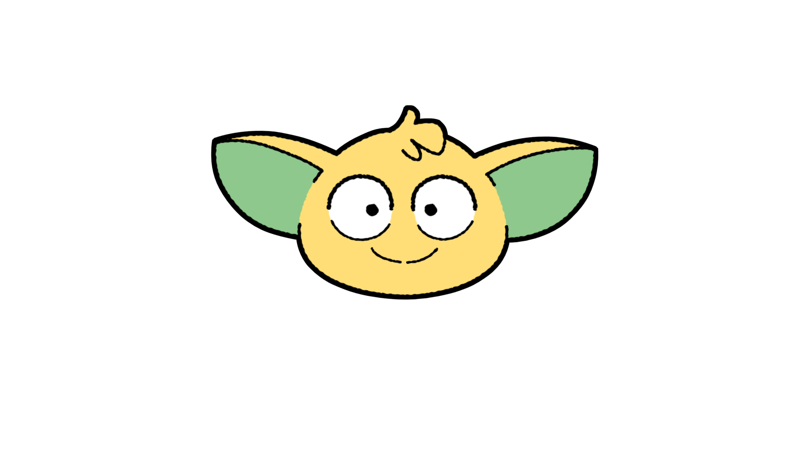
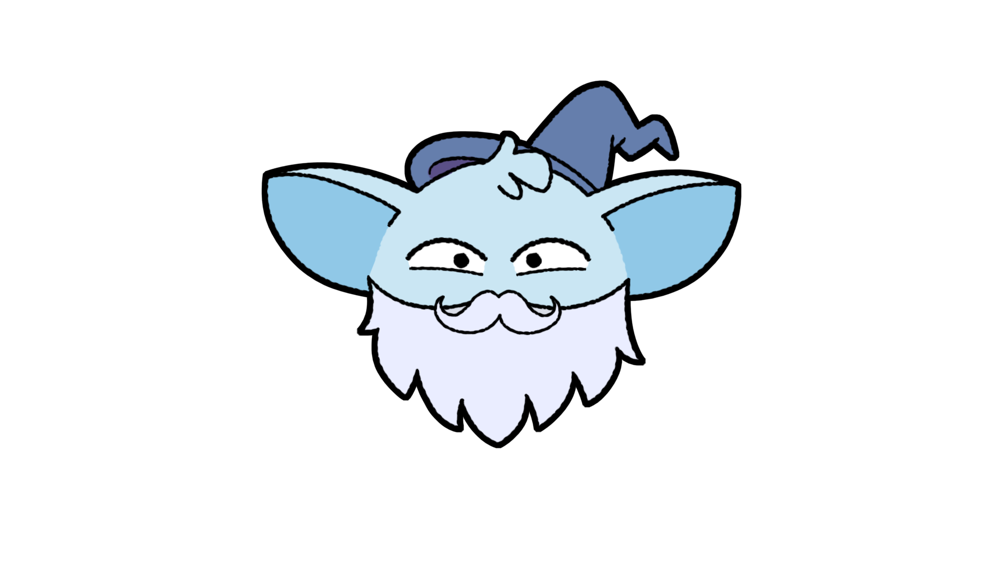
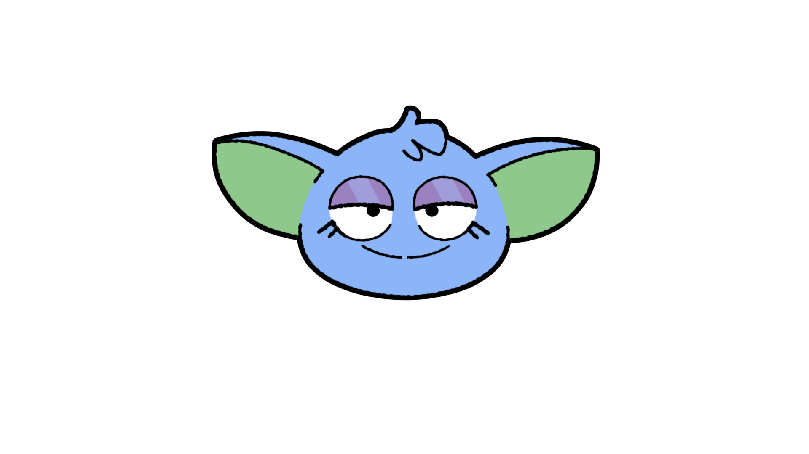
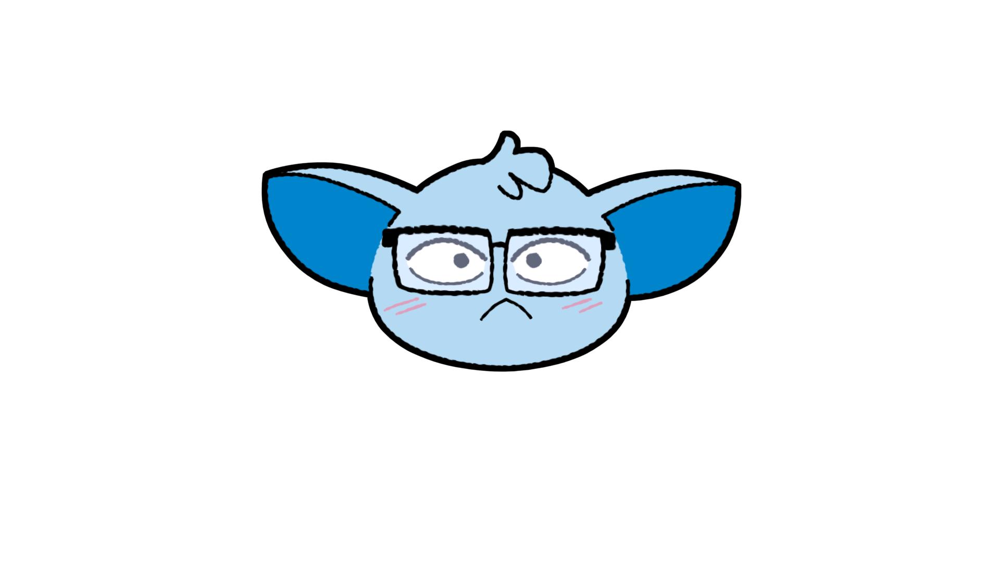
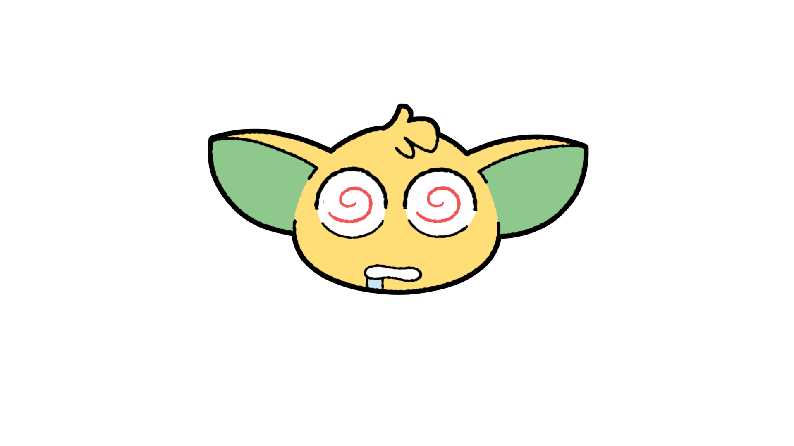
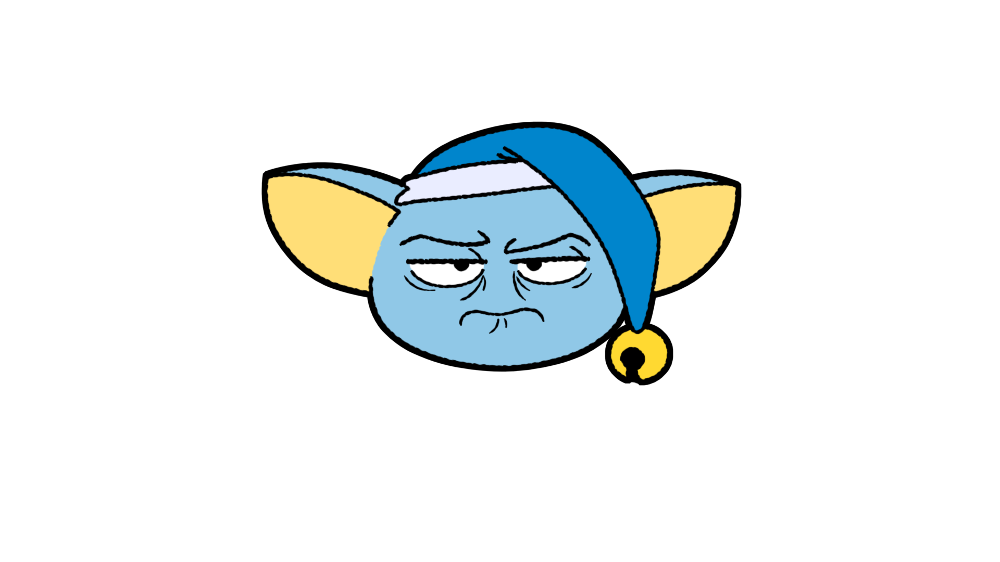
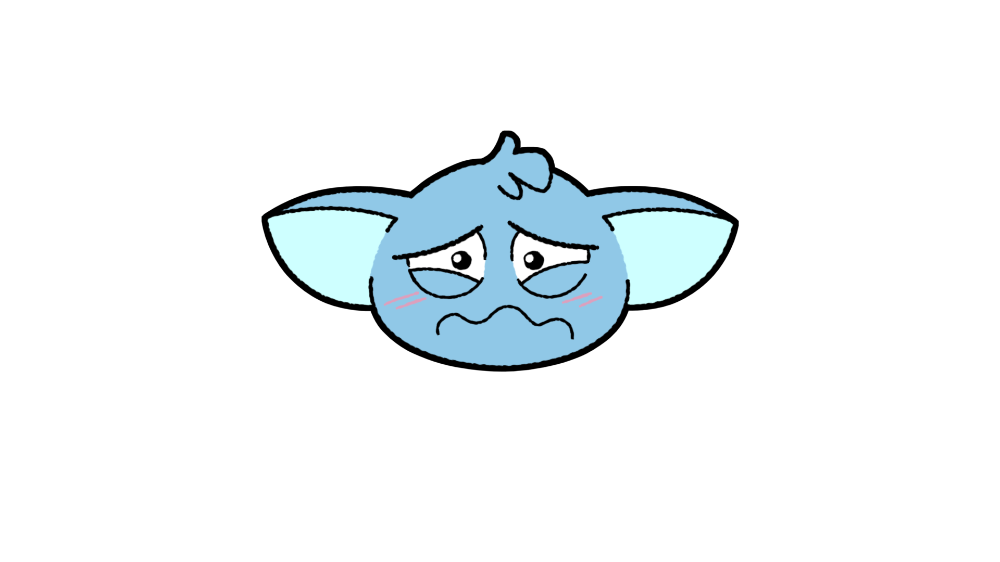
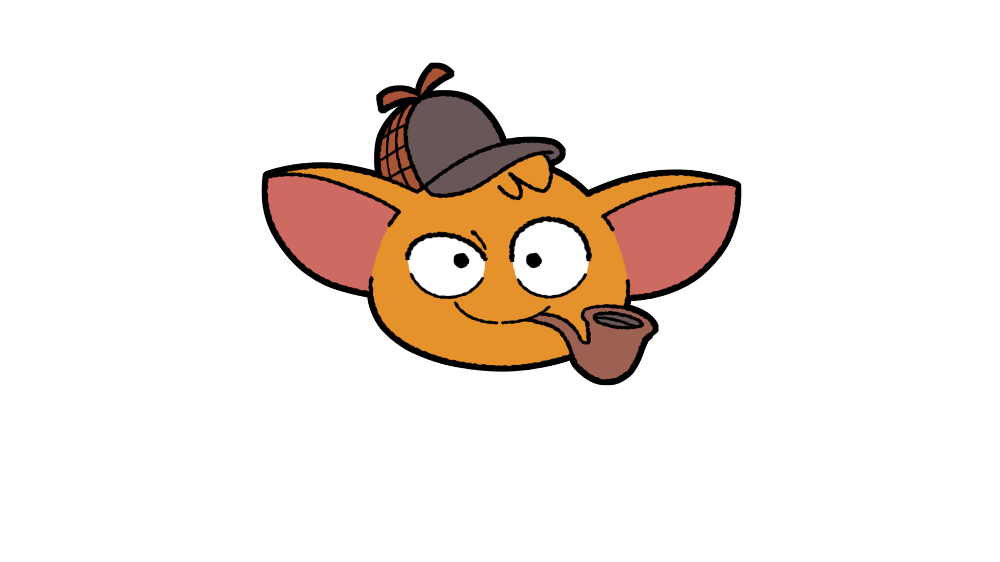

<div align="center">


# Koda · EduAI Tutor

**Un tuteur qui accompagne, sans donner la réponse.**

Plateforme d'apprentissage du développement Python, à architecture multi-agents
et récupération documentaire, pour un organisme de formation professionnelle.

<br>


</div>

---

> Ce dépôt sert de support d'évaluation pour la certification **RNCP 37827 —
> Développeur en intelligence artificielle** (Simplon, titre 2026). Les chiffres
> qui suivent sont **relevés sur l'installation**, datés du 4 septembre 2026, et
> non repris d'une version antérieure de ce document.

---

## Voici Koda

<table>
<tr>
<td width="360" align="center"></td>
<td>

**Il lit la page avec vous.** Koda voit le cours ouvert et répond dessus — pas
en général.

**Il répond à la mesure.** Une politesse reçoit une phrase, pas un chapitre. Et
ces échanges-là n'encombrent pas votre fiche.

**Il vit.** Il cligne des yeux, s'assoupit au bout de deux minutes, se réveille
quand on lui parle. Et si sa place vous gêne, attrapez-le et posez-le ailleurs.

</td>
</tr>
</table>

<div align="center">


<br>


<br>



<sub><strong>Vingt avatars</strong> — chacun choisit le sien.</sub>
</div>

---

## Démarrer

### Prérequis

- **Python 3.13** et [uv](https://docs.astral.sh/uv/)
- **Docker** et Docker Compose — PostgreSQL tourne en conteneur, **port hôte 5433**
- Une clé `GROQ_API_KEY` pour les agents ; sans elle, l'application se lance et
  tout ce qui n'appelle pas le modèle fonctionne
- **Ollama**, pour l'embarquement du RAG (`mxbai-embed-large`)

### En quatre commandes

```bash
uv sync                          # dépendances, verrouillées par uv.lock
cp .env.example .env             # puis renseigner les variables
docker compose up -d postgres    # PostgreSQL, port 5433
uv run python manage.py migrate  # schéma de l'application
```

### Puis les données

```bash
uv run python manage.py importer_referentiel apps/referentiel/donnees/eduai-2026.json --activer
uv run python manage.py importer_cours
```

> 💡 Dans l'image de déploiement, ces deux imports sont **joués au démarrage si
> la base est vide** (`docker/entree-web.sh`) : un déploiement neuf sert des
> données, pas des pages vides. Une garde empêche qu'un redémarrage republie les
> cours.

### Et c'est parti

```bash
uv run python manage.py runserver     # http://127.0.0.1:8000/
```

L'accueil est la page d'arrivée. Le générateur de cours est une entrée de
l'onglet **Cours**, pas une page à part.

---

## Ce que fait l'application

<table>
<tr>
<td width="360" align="center"></td>
<td>

### 📚 Des cours, et votre fiche

**7 compétences** du module Python portent un cours publié, composé de
**36 parties** issues des supports de l'organisme. Chaque apprenant en tire
**sa fiche** : ses questions, les réponses de Koda, et l'attribution des sources
qui les ont produites.

</td>
</tr>
<tr>
<td align="center"></td>
<td>

### 🎯 Des quiz, solo et à plusieurs

Ils signalent les lacunes, ils ne certifient aucun niveau. Un salon, un code,
et on joue ensemble — le podium reste à l'écran jusqu'à ce qu'on le quitte.

</td>
</tr>
<tr>
<td align="center"></td>
<td>

### 💻 Des exercices, sous deux formes

**L'exercice seul** corrige par des tests et enregistre la soumission — il
*mesure*. **Le carnet** enchaîne de 5 à 20 énoncés dans une page et s'exporte
en `.ipynb` ouvrable dans Jupyter — il *accompagne*. Ce ne sont pas les mêmes
gestes.

</td>
</tr>
<tr>
<td align="center"></td>
<td>

### 🔁 Revoir ses vraies erreurs

Les questions **réellement manquées** sont reposées telles quelles, avec la
réponse que vous aviez donnée pour distracteur. Aucune génération n'est
consommée — tout est déjà en base — donc la révision reste disponible **quand
le quota est épuisé**, c'est-à-dire quand vous avez beaucoup travaillé.

</td>
</tr>
</table>

---

## Architecture

Cinq ensembles, et deux séparations qui doivent rester lisibles.

| Ensemble | Où | Épreuve |
|---|---|---|
| 🔄 Pipeline de données | `data_pipeline/` | E1 (C1–C4) |
| 📊 API du jeu de données — **DRF** | `apps/api_data/` | E1 (C5) |
| 🤖 API du service IA — **FastAPI** | `service_ia/` | E2 (C9) |
| 🌐 Application web Django | `apps/` | E4 (C17) |
| 📈 Monitorage du service IA | `apps/monitoring/` | E5 (C20) |

**Deux API, deux frameworks, deux processus.** DRF sert le jeu de données depuis
le projet Django ; FastAPI sert le service IA à part. La séparation se voit sans
explication (décision 015).

**Deux bases sur une seule instance PostgreSQL**, port 5433 :

```
eduai_app    →  l'application         schéma géré par les migrations Django
eduai_data   →  le jeu de données     schéma géré par data_pipeline/load/sql/
```

PostgreSQL n'autorise aucune requête inter-bases sans extension : l'isolation est
**structurelle**, pas conventionnelle. Le pipeline peut donc purger et recharger
son corpus sans qu'aucune erreur de ciblage n'atteigne les comptes des
apprenants (décision 006).

> ⚠️ **ChromaDB n'est pas la base de C4.** C'est un artefact aval, produit par
> l'indexation du corpus.

---

## Le jeu de données

Six sources, **cinq types** — le référentiel en exige cinq.

| | Source | Type | Documents |
|---|---|---|---|
| 🌐 | S1 Stack Overflow | API REST | 1 273 |
| 📖 | S2 Documentation Python | scraping | 234 |
| 📁 | S3 Corpus pédagogique | fichier | 381 |
| 🗄️ | S4 Productions des apprenants | base de données | 27 |
| 🐘 | S5 Dumps Stack Exchange | big data | 4 948 |
| 📚 | S6 Documentation des bibliothèques | scraping | 1 005 |
| | **Total actif** | | **7 868** |

Avec **1 211 mots-clés**, **20 545 rattachements**, 15 campagnes d'extraction,
**0 rejet** au chargement. L'API en expose **7 759** : les 81 aides-mémoire de
DataCamp, le document sans licence déclarée et les 27 productions d'apprenants
sont retenus par `redistribution_autorisee`.

**Chaque document porte une licence vérifiée**, jamais supposée — y compris les
supports de cours, qui viennent de « Python Cheatsheet » de wilfredinni (MIT) et
non du projet lui-même : la vérification du 4 septembre l'a établi, et le
manifeste le dit fichier par fichier. Les aides-mémoire de DataCamp sont
librement téléchargeables mais leurs conditions interdisent la redistribution ;
un fichier issu d'un dépôt sans `LICENSE` porte `SANS-LICENCE`, car l'absence de
licence réserve tous les droits.

> **Gratuit à télécharger n'est pas libre de droits.** La nomenclature le dit, et
> l'API en tire les conséquences.

**S4 rend peu, et c'est structurel.** Elle exploite le travail des apprenants,
que le droit à l'effacement supprime avec leur compte. Plus l'effacement est
effectif, moins cette source a de matière — la décision 045 énonce la tension et
dit laquelle des deux exigences cède.

### Rejouer le pipeline

```bash
uv run python -m data_pipeline.orchestrator                  # extraction → transformation → chargement
uv run python -m data_pipeline.orchestrator --sans-extraction
uv run python -m data_pipeline.load.purge --a-blanc          # ce que la purge supprimerait
```

Chaque étape est **idempotente** : la relancer ne duplique rien. Les requêtes
vivent dans des fichiers dédiés — **22 fichiers SQL, dont 3 en Spark SQL** — avec
en en-tête leur objectif, leurs filtres et leurs optimisations.

### Corpus vectoriel

Deux collections, et elles ne répondent pas à la même question :

| Collection | Fragments | Ce qu'elle sert |
|---|---|---|
| `eduai_knowledge_base` | **387** | le contexte des agents |
| `eduai_corpus_documentaire` | **24 004** | la recherche documentaire |

Le corpus n'est **pas** dans le dépôt ni dans les images : il est monté depuis un
volume persistant et mis à jour hors ligne (décision 023).

---

## Tests et intégration continue

```bash
DJANGO_DEBUG=False uv run pytest        # 394 tests
uv run ruff check .
```

`DJANGO_DEBUG=False` n'est pas décoratif : hors debug, l'application redirige
tout appel en clair vers HTTPS, et un test qui ne simule pas la requête sécurisée
n'atteint jamais la vue.

La chaîne GitHub Actions compte **cinq travaux** — qualité, tests, construction
et contrôle des deux images, publication au registre avec déclenchement du
déploiement. Elle s'exécute à chaque poussée ; la publication ne se fait que
depuis `main`.

<table>
<tr>
<td width="360" align="center"></td>
<td>

Un principe traverse la suite : **un test éprouve un effet, jamais une
intention.** Plusieurs gardes existent parce qu'un défaut est passé — la
concordance des classes CSS avec la feuille compilée, l'équilibre des balises de
bloc des gabarits, l'échappement des traductions insérées dans du JavaScript, et
le fait qu'une page qui pilote Koda le charge effectivement.

</td>
</tr>
</table>

---

## Feuille de style (Tailwind)

La feuille est **compilée hors ligne** et versionnée : `static/css/tailwind.css`.
Les gabarits la lient par `` ; aucune page ne charge plus
`cdn.tailwindcss.com`.

### Reconstruire après avoir ajouté une classe

```bash
bash theme/tailwind-v3/construire.sh
```

Le script télécharge au besoin le binaire autonome de Tailwind 3.4.17 (43 Mio,
non versionné) et régénère la feuille depuis `theme/tailwind-v3/`.

**À lancer après toute modification de gabarit introduisant une classe
nouvelle.** Sans reconstruction, la classe ne produit aucun style et rien ne le
signale : la page s'affiche, simplement de travers. Le test
`tests/test_coquille_interface.py` échoue dans ce cas — il compare toutes les
classes des gabarits au contenu de la feuille.

### Ce qui est versionné

La feuille compilée, comme les catalogues `.mo` : l'image de déploiement est
bâtie sur le clone, et une feuille absente donnerait une application sans
styles que personne ne verrait avant la démonstration.

### Pourquoi pas `manage.py tailwind build`

`django-tailwind` est bien installé, mais son nécessaire est en **Tailwind 4**
alors que l'application a toujours été rendue en **3.4.17** ; et sa
construction échoue sur le Node 12 de la machine. Le binaire autonome produit
exactement la version que servait le CDN — équivalence vérifiée en comparant la
géométrie de tous les éléments sur six pages (décision 034).

### Où sont les classes

Le champ `content` de `theme/tailwind-v3/tailwind.config.js` couvre les
gabarits **et** `apps/**/*.py` : les widgets de formulaire déclarent leurs
classes en Python. Un chemin oublié donne une page sans styles.

---

## Internationalisation (français / anglais)

L'interface est servie en **français par défaut**, en anglais si le compte le
demande. La langue vient de `language_preference`, un champ du compte, appliqué
à chaque requête par `apps.users.middleware.LangueDeLApprenant`. Elle suit donc
la personne d'un poste à l'autre, contrairement à un cookie.

Les catalogues vivent à **un seul endroit** : `locale/fr/` et `locale/en/`.

### Mettre à jour les traductions

**Toute chaîne ajoutée dans un gabarit ou dans du code Python doit passer par
ces trois commandes.** Un `.po` non régénéré n'échoue pas : la chaîne s'affiche
simplement dans sa langue source, au milieu du reste. C'est un écart
silencieux, et ce projet en a documenté assez pour ne pas en ajouter un.

```bash
# 1. Relever les chaînes nouvelles ou modifiées dans les deux catalogues
uv run python manage.py makemessages -l fr -l en \
    --ignore=.venv --ignore=staticfiles --ignore=node_modules \
    --ignore=theme/static --ignore=data_pipeline --ignore=benchmark

# 2. Traduire : éditer locale/fr/LC_MESSAGES/django.po et locale/en/…
#    Une entrée msgstr vide signifie « utiliser la chaîne source ».

# 3. Compiler — sans cette étape, la traduction reste sans effet
uv run python manage.py compilemessages --ignore=.venv
```

Les `--ignore` ne sont pas décoratifs : sans eux, `makemessages` parcourt
l'environnement virtuel et les dépendances, et `compilemessages` recompile les
catalogues de Django lui-même.

### Ce qui est versionné

Les `.po` **et** les `.mo`. Les fichiers compilés sont habituellement exclus
d'un dépôt, mais les images de déploiement sont construites à partir du clone :
sans les `.mo`, l'application déployée servirait ses chaînes sources, et
personne ne le verrait avant la démonstration.

### Écrire une chaîne traduisible

```django


Bonjour {{ nom }}
{{ n }} cours{{ n }} cours
```

```python
from django.utils.translation import gettext as _
messages.success(request, _("Cours enregistré."))
messages.error(request, _("Erreur : %(motif)s") % {"motif": motif})
```

**Substitution nommée, jamais positionnelle** : `%(motif)s` peut changer de
place dans une traduction, `%s` non.

**Le signe pour cent ne survit pas à ``.** Écrit dans un gabarit,
`{% trans "%(joueur)s a gagné" %}` produit dans le catalogue l'identifiant
`%%(joueur)s a gagné`, doublé, alors que l'exécution demandera la version
simple. La traduction n'est jamais trouvée, et **rien ne le signale** : la
chaîne source s'affiche, ce qui passe inaperçu tant que la langue source est
celle qu'on regarde. Dans une chaîne de gabarit destinée à recevoir une valeur
côté navigateur, employer un repère neutre — `{joueur}` — et le remplacer en
JavaScript.

**Les chaînes assemblées en JavaScript se déclarent en tête du gabarit**, avec
``, puis se lisent avec `{{ libelle|escapejs }}`.
Sans `escapejs`, une apostrophe française suffit à casser la chaîne JavaScript
qui la porte.

### Ce qui n'est pas traduit, et pourquoi

Les messages d'erreur des deux API, les journaux, la documentation et le corpus
documentaire. Les motifs sont écrits dans `docs/decisions/025-portee-de-la-traduction.md`
et `docs/reserves.md` (réserve 10).

### Vérifier

```bash
DJANGO_DEBUG=False uv run pytest tests/test_i18n.py
```

Ces tests portent sur l'**effet** du réglage sur la page servie, jamais sur sa
présence en base : le champ `language_preference` existait depuis l'origine et
n'était lu par personne pour l'affichage.

---

---

---

## Où sont les preuves

| Document | Ce qu'il porte |
|---|---|
| [`docs/traceabilite.md`](docs/traceabilite.md) | La matrice des 21 compétences : verdict, preuve, emplacement |
| [`docs/decisions/`](docs/decisions/) | **45 décisions** d'architecture : contexte, options, choix, raison |
| [`docs/incidents/`](docs/incidents/) | **18 incidents** : symptôme, cause, correction, garde posée |
| [`docs/reserves.md`](docs/reserves.md) | **23 réserves** — ce qui est connu, assumé et non corrigé |
| [`docs/motifs_incidents.md`](docs/motifs_incidents.md) | Les familles de défauts qui reviennent dans ce projet |
| [`docs/mcd_eduai_data.md`](docs/mcd_eduai_data.md) · [`mld`](docs/mld_eduai_data.md) · [`dictionnaire`](docs/dictionnaire_donnees_eduai_data.md) | Modélisation de `eduai_data` |
| [`docs/rgpd_eduai_data.md`](docs/rgpd_eduai_data.md) | Minimisation, conservation, effacement |
| [`docs/securite_api_donnees.md`](docs/securite_api_donnees.md) · [`service IA`](docs/securite_api_service_ia.md) | OWASP API Top 10, point par point |
| [`docs/chaine_livraison.md`](docs/chaine_livraison.md) | Installation, images, déploiement, et sept contrôles exécutables |
| [`docs/benchmark_modeles.md`](docs/benchmark_modeles.md) | Comparaison de trois modèles, protocole écrit avant la mesure |
| [`docs/strategie_tests.md`](docs/strategie_tests.md) | Ce que la suite défend, et ce qu'elle ne couvre pas |
| [`docs/journal/`](docs/journal/) | Notes de session : ce qui a été fait, et les difficultés |

<table>
<tr>
<td width="360" align="center"></td>
<td>

Les **réserves** et les **incidents** sont des documents de première importance
pour ce dépôt : ils disent ce qui a été raté, ce qui reste imparfait, et
pourquoi. *Un projet sans défauts documentés est un projet dont les défauts ne
sont pas encore trouvés.*

</td>
</tr>
</table>

---

## Licence

**Tous droits réservés** — voir [`LICENSE`](LICENSE).

La consultation et l'**exécution** sont expressément autorisées, y compris pour
un jury de certification : ce dépôt est fait pour être rejoué. La
redistribution, l'usage en produit ou en formation, et l'entraînement d'un
modèle sur ce contenu demandent un accord écrit.

Les **contenus tiers** en sont exclus et gardent leur propre licence : le corpus
collecté est sous CC BY-SA, BSD, MIT, Apache, PostgreSQL et PSF, et les supports
de cours sous MIT, avec leurs obligations d'attribution. Le détail est dans la
licence elle-même et dans
[`docs/provenance-ressources.md`](docs/provenance-ressources.md).

<div align="center">
<br>


<sub>Illustrations de Koda — <strong>Camille Catry</strong>, cédées pour cet usage.</sub>
<br><br>
<sub><strong>Dorothée Catry</strong> · RNCP 37827 · Simplon, titre 2026</sub>
</div>
