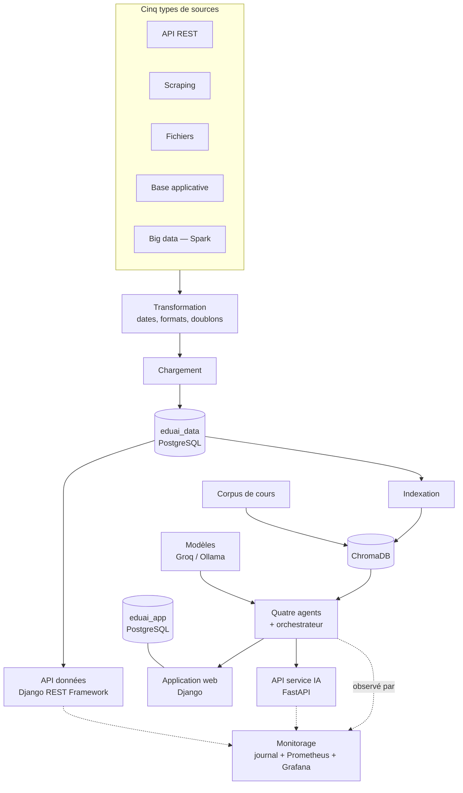

# Cadre technique

**Date :** 28 août 2026
**Compétence visée :** C15 (épreuve E4) — cadre technique du projet
**Compétences concernées :** C13 (E3) — conteneurisation ; C17, C18, C19 (E4)

---

## 1. L'architecture générale

### 1.1 Description textuelle

Cette description **est** le schéma. Elle n'en est pas la légende : un schéma
dont l'équivalent textuel est un résumé appauvri n'est pas accessible. Ce qui
suit contient tout ce que le diagramme du § 1.2 montre.

Le système comporte **cinq ensembles**, reliés dans un sens unique — des données
vers l'usage.

**Premier ensemble, le pipeline de données.** Cinq extracteurs indépendants, un
par type de source : une API REST, un scraping de documentation, une lecture de
fichiers, une lecture de base de données applicative, et un traitement big data
en Spark sur un dump XML. Chacun écrit un fichier JSON Lines dans un répertoire
commun. Une couche de transformation lit l'ensemble de ces fichiers et produit
un corpus unique — dates normalisées en ISO 8601, formats homogénéisés, doublons
retirés. Un chargeur verse ce corpus dans PostgreSQL. Un orchestrateur enchaîne
les trois étapes depuis un point de lancement unique.

**Deuxième ensemble, les deux bases.** Une seule instance PostgreSQL 16, en
conteneur, publiée sur la boucle locale au port 5433, contient deux bases
distinctes. `eduai_data` reçoit le corpus du pipeline ; son schéma est géré par
des scripts SQL versionnés. `eduai_app` sert l'application web ; son schéma est
géré par les migrations Django. **PostgreSQL n'autorise pas de requête
inter-bases sans extension : l'isolation est structurelle, pas
conventionnelle.** Le pipeline peut donc purger et recharger son corpus sans
qu'aucune erreur de ciblage n'atteigne les comptes des apprenants.

**Troisième ensemble, les deux API.** L'API de mise à disposition du jeu de
données est écrite en Django REST Framework et vit dans le projet Django ; elle
lit `eduai_data` en lecture seule, à travers un routeur de base qui lève une
exception sur toute écriture. L'API du service d'intelligence artificielle est
écrite en FastAPI et tourne dans un **processus séparé**, dans son propre
conteneur. Deux frameworks, deux périmètres : un lecteur voit deux API, pas deux
dossiers.

**Quatrième ensemble, l'application et les agents.** L'application web Django
sert les pages aux apprenants. Quatre agents — Researcher, Pedagogue, Coach,
Watcher — et un orchestrateur appellent les modèles via LangChain, chaque agent
étant routé vers le modèle qui lui convient. Une recherche documentaire
s'appuie sur ChromaDB, alimenté d'un côté par le corpus de cours et de l'autre
par le corpus documentaire de `eduai_data`.

**Cinquième ensemble, le monitorage.** Une sonde branchée sur le mécanisme de
rappels de LangChain observe tous les appels aux modèles et toutes les
recherches documentaires, quel que soit le processus qui les émet. Elle écrit un
journal JSON Lines **hors base de données** et alimente des compteurs Prometheus,
restitués par un tableau de bord Grafana provisionné depuis un fichier.

**Le sens de lecture** : les sources alimentent le pipeline, le pipeline
alimente `eduai_data`, `eduai_data` alimente l'API données et le vector store,
le vector store et les modèles alimentent les agents, les agents alimentent
l'application et l'API du service IA. Le monitorage est transversal : il observe
les agents et les deux API, sans être sur le chemin des données.

### 1.2 Diagramme

---

## 2. Les choix techniques

Les justifications ne sont pas recopiées ici : elles vivent dans le journal de
décisions, qui est leur emplacement de référence. Ce tableau **renvoie**.

| Choix | Décision |
|---|---|
| Modèles externalisés chez un fournisseur, routage par agent | 001 |
| Cadre d'usage et public adulte exclusif | 004, 005 |
| Deux bases PostgreSQL plutôt qu'une | 006 |
| Types physiques et stratégie d'index | 007 |
| Configuration par variables d'environnement | 008 |
| Source big data en Spark sur dump Stack Exchange | 009 |
| Couche de transformation séparée, clés de déduplication | 011 |
| API données en lecture seule, routeur de base | 012 |
| Marquage des documents disparus plutôt que purge | 013 |
| Monitorage hors base | 014 |
| Deux frameworks pour deux API | 015 |
| Comparaison de modèles avant décision de routage | 016 |
| Une mesure d'échelle n'étend pas le corpus | 017 |

Trois de ces choix structurent tout le reste et méritent d'être rappelés en une
phrase chacun.

**Deux bases distinctes** (006) : parce qu'un pipeline qui purge et recharge son
corpus ne doit pas pouvoir se tromper de cible et atteindre les comptes des
apprenants. L'isolation par base est structurelle ; une isolation par convention
de nommage ne l'aurait pas été.

**Deux frameworks pour deux API** (015) : parce que le référentiel distingue
l'API qui expose le jeu de données de celle qui expose le service d'IA, et que
cette distinction doit être lisible sans explication.

**Monitorage hors base** (014) : parce qu'un incident touchant PostgreSQL
rendrait le journal indisponible au moment précis où il servirait.

---

## 3. La pile technique

| Domaine | Outils | Versions |
|---|---|---|
| Langage | Python | ≥ 3.12, < 3.14 |
| Application web | Django, Django REST Framework, Channels, Redis, Tailwind | Django ≥ 5.2.4 ; DRF ≥ 3.16 |
| Service IA | FastAPI, Pydantic, slowapi | FastAPI ≥ 0.115 |
| Agents et RAG | LangChain, LangChain Community, LangChain Groq, ChromaDB | LangChain ≥ 0.3.26 ; ChromaDB ≥ 1.0.15 |
| Modèles | Groq (`gpt-oss-120b`, `gpt-oss-20b`), Ollama (`qwen3:4b`, `mxbai-embed-large`) | — |
| Données | PostgreSQL, psycopg, PySpark | PostgreSQL 16 ; PySpark ≥ 3.5, < 4.0 |
| Qualité | pytest, pytest-django, ruff | — |
| Exécution | Docker, Docker Compose | — |
| Gestion de paquets | **uv** | — |

**Sur le choix d'`uv`** : il est le gestionnaire du projet, et le fichier
`uv.lock` est versionné. La chaîne d'intégration installe avec `--frozen`, ce
qui garantit que ce qui est éprouvé en intégration est ce qui tourne en local.
Sans verrou, un test qui passe aujourd'hui et échoue demain ne dirait rien sur
le code.

**Sur la contrainte de version Python** : la borne haute n'est pas une
précaution mais une contrainte réelle — `RestrictedPython` et `django-tailwind`
ne suivent pas encore la 3.14. Elle est inscrite dans `pyproject.toml` avec son
motif, plutôt que subie à la prochaine mise à jour.

---

## 4. Les environnements

### 4.1 Les services conteneurisés

| Service | Image | Exposition |
|---|---|---|
| `postgres` | `postgres:16-alpine` | `127.0.0.1:5433` — **boucle locale uniquement** |
| `service_ia` | `eduai/service-ia:1.0.0` | `network_mode: host`, écoute sur la boucle locale |
| `prometheus` | `prom/prometheus:v2.55.1` | `network_mode: host`, boucle locale |
| `grafana` | `grafana/grafana:11.3.1` | `network_mode: host`, boucle locale |

Trois volumes nommés persistent les données : `postgres_data`,
`prometheus_data`, `grafana_data`.

**Deux points de configuration qui ont chacun coûté un incident.**

La publication de PostgreSQL sur `127.0.0.1` et non sur `0.0.0.0` : le port
avait été exposé à tout le réseau, et corriger le fichier n'avait pas suffi —
un `restart` ne recrée pas un conteneur, il faut `--force-recreate`.

Le `network_mode: host` de Prometheus et Grafana : les deux conteneurs ne
pouvaient pas atteindre une application Django qui n'écoute que sur la boucle
locale de l'hôte. Le réseau ponté de Docker ne donne pas accès à `127.0.0.1` de
l'hôte.

**Le tableau de bord Grafana est provisionné depuis un fichier**, jamais
construit dans l'interface. Un tableau cliqué vit dans un volume Docker et
disparaît au premier `down -v` ; un tableau provisionné est dans le dépôt.

### 4.2 L'intégration continue

Trois travaux parallèles, sur chaque poussée et chaque branche, **aucun en
`continue-on-error`** : qualité du code, tests sur une base PostgreSQL 16 réelle
avec rejeu des scripts de schéma depuis zéro, construction de l'image du service
IA suivie de l'inspection de son contenu.

### 4.3 Les secrets

Aucun secret dans le dépôt. Tout passe par des variables d'environnement, avec
un `.env` local non versionné. La chaîne d'intégration utilise des valeurs sans
valeur hors de son contexte : la base est créée puis détruite avec le travail.

### 4.4 Le contrôle de version

Une branche par chantier, nommée `<type>/<bloc>-<sujet>`. Les messages de commit
portent la ou les compétences entre crochets, ce qui rend l'historique
interrogeable par compétence — `git log --grep="\[C7\]"`. Un crochet de
pré-commit refuse les commits directs sur `main` ; il vit dans `.git/hooks/`
plutôt que sous `core.hooksPath`, une tentative précédente ayant échoué parce
qu'un chemin de crochets pointant dans l'arbre de travail n'existe pas sur une
branche qui ne contient pas le fichier.

---

## 5. Les contraintes matérielles, et leur effet réel

Cette section n'est pas un inventaire : chaque contrainte y est suivie de la
décision qu'elle a produite. Une contrainte sans conséquence n'aurait pas à être
mentionnée.

| Contrainte | Effet sur les choix |
|---|---|
| **GPU de 4 Go** | Aucun entraînement ni affinage de modèle n'est envisageable. Le projet **intègre** des modèles, il n'en produit pas. C'est ce qui rend sans objet les volets « entraînement, évaluation, validation » des compétences C11 et C12 |
| **Partition racine de 96 Go, occupée à 75 %** | A **bloqué la construction de l'image Docker** du service IA. A conduit au `.dockerignore` qui a ramené l'image de 10,1 Go à 5,22 Go, puis à un contrôle en intégration continue qui garde ce gain |
| **Machine mono-poste, 8 cœurs, 31 Go de mémoire** | Impose des mesures séquentielles et **le relevé de l'état de la machine avec chaque mesure** : deux exécutions d'une même conversion se sont écartées de 17 % pour une contention disque, non pour une raison de code |
| **Modèle local sur cette machine** | `qwen3:4b` répond en environ 100 secondes là où le fournisseur distant répond en moins d'une. **Le repli local est de deux ordres de grandeur plus lent** : c'est un repli dégradé, et il est présenté comme tel — un repli annoncé équivalent serait moins crédible qu'un repli assumé |
| **Palier gratuit du fournisseur de modèles** | Tient environ dix appels par minute sur les prompts du projet. Pour une classe travaillant simultanément, la question du palier payant se pose **avant** celle du choix du modèle |
| **Un seul développeur** | Détermine la démarche projet : pas de revue par un pair, pas d'estimation collective. Voir `demarche_projet.md` |

---

## Pièces citées

| Document | Contenu |
|---|---|
| `decisions/` | Les dix-sept décisions et leurs justifications |
| `analyse_besoin.md` | Ce que ce cadre technique sert à réaliser |
| `demarche_projet.md` | Comment le travail a été conduit |
| `securite_api_donnees.md`, `securite_api_service_ia.md` | OWASP API Top 10 appliqué aux deux API |
| `monitorage_metriques.md` | Les métriques et leur interprétation |
| `incidents/` | Les pannes qui ont produit plusieurs des choix ci-dessus |
