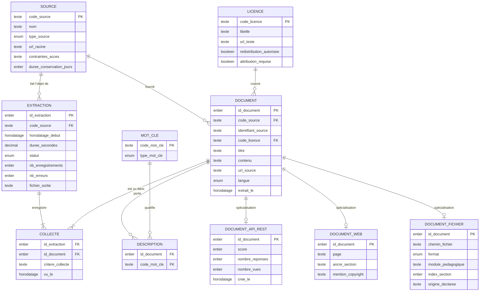

# Modèle conceptuel de données — base `eduai_data`

**Date :** 26/08/2026
**Statut :** proposé, en attente de validation
**Compétence visée :** C4 (épreuve E1) — création d'une base de données dans le
respect du RGPD
**Périmètre :** uniquement les documents collectés par les cinq extracteurs du
pipeline. La base applicative `eduai_app` (utilisateurs, cours, exercices,
quiz) fait l'objet d'un modèle distinct, relevant de C17.

---

## 1. Ce que le modèle doit accueillir

Le contrat de données commun aux cinq extracteurs est la dataclass
`Enregistrement` de
[base_extractor.py](../data_pipeline/extract/base_extractor.py) : `identifiant`,
`titre`, `contenu`, `source_nom`, `source_type`, `source_url`, `licence`,
`langue`, `extrait_le`, `metadonnees`.

Trois sources sur cinq sont déjà extraites. Le modèle est construit sur leurs
données réelles, et non sur une projection théorique :

| Source | Type de source | Documents | Langue | Licences distinctes |
|---|---|---|---|---|
| Stack Overflow | `api_rest` | 1 313 | en | 1 — CC BY-SA 4.0 |
| Documentation Python | `scraping` | 235 | en | 1 — PSF License Agreement |
| Corpus pédagogique local | `fichier` | 380 | fr | 2 — Propriétaire (298), à vérifier (82) |
| **Total** | | **1 928** | | **4** |

Les deux sources restantes — S4 (base de données) et S5 (système big data) —
ne sont pas encore écrites. Le modèle doit les accueillir sans être remanié.

### Le champ `metadonnees` diffère selon la source

C'est le point qui structure tout le modèle. Chaque extracteur remplit un
dictionnaire de forme différente :

| Source | Clés de `metadonnees` |
|---|---|
| Stack Overflow | `tag_recherche`, `tags`, `score`, `nombre_reponses`, `vues`, `cree_le` |
| Documentation Python | `section_html`, `page`, `copyright` |
| Corpus local | `module`, `fichier`, `format`, `origine`, `section_index` |

Aucune clé n'est commune aux trois. Un modèle qui les aplatirait dans une même
table produirait une majorité de colonnes vides.

---

## 2. Deux constats issus des données, et ce qu'ils imposent

### 2.1 Un document peut être collecté plusieurs fois dans une même exécution

Sur les 1 928 enregistrements bruts, **40 identifiants apparaissent deux fois**
— 1 888 documents distincts. Exemple relevé dans les données :

```
so_16476924   tag_recherche = python    tags = [python, pandas, dataframe, loops]
so_16476924   tag_recherche = pandas    tags = [python, pandas, dataframe, loops]
```

Il ne s'agit pas de deux documents mais **d'un seul document atteint par deux
chemins de collecte**. Le critère de recherche (`tag_recherche`) est donc une
propriété de l'acte de collecte, pas du document.

Conséquence sur le modèle : une association **COLLECTE** porte le critère,
entre l'extraction et le document. Ce choix résout au passage l'idempotence —
relancer un extracteur ajoute des collectes, sans dupliquer les documents.

### 2.2 Une source peut porter plusieurs licences

Le corpus local mélange du contenu produit par l'autrice (298 documents) et des
fichiers d'origine non tranchée (82 documents, licence « A VERIFIER »).

Conséquence : la licence se rattache au **document**, pas à la source. Rattacher
la licence à la source aurait fait disparaître cette distinction, alors qu'elle
conditionne le droit de redistribuer.

---

## 3. Entités

### SOURCE

Les cinq sources exigées par le référentiel. Table de faible cardinalité (5
lignes) mais structurante : c'est elle qui rend la couverture des cinq types
vérifiable par une seule requête.

| Attribut | Nature | Rôle |
|---|---|---|
| `code_source` | texte court | Identifiant naturel : `s1`, `s2`, `s3`, `s4`, `s5` |
| `nom` | texte | Libellé lisible (« Stack Overflow ») |
| `type_source` | énuméré | `api_rest`, `scraping`, `fichier`, `base_donnees`, `big_data` |
| `url_racine` | texte | Point d'entrée de la source, nul pour une source locale |
| `contraintes_acces` | texte | Quota, `robots.txt`, conditions d'utilisation — exigé par C1 |
| `duree_conservation_jours` | entier | Durée au-delà de laquelle les documents sont purgés (RGPD) |

`type_source` est énuméré et non libre : les cinq valeurs sont fixées par le
référentiel, une valeur hors liste serait une erreur de saisie.

### EXTRACTION

Une exécution d'un extracteur. Correspond au bilan déjà retourné par
`ExtracteurBase.executer()`, aujourd'hui seulement journalisé.

| Attribut | Nature | Rôle |
|---|---|---|
| `id_extraction` | identifiant | |
| `horodatage_debut` | horodatage | Début de l'exécution |
| `duree_secondes` | décimal | |
| `statut` | énuméré | `succes`, `echec` |
| `nb_enregistrements` | entier | Volumétrie produite |
| `nb_erreurs` | entier | Erreurs tolérées pendant l'exécution |
| `fichier_sortie` | texte | Chemin du JSONL brut, pour rejouer la transformation |

Cette entité n'existait dans aucune version antérieure du pipeline. Elle est
ajoutée pour trois raisons : la traçabilité exigée par C1, la possibilité de
comparer deux exécutions pour détecter une source qui se dégrade, et l'ancrage
de la purge RGPD sur une date d'extraction plutôt que sur une date de contenu.

### DOCUMENT

L'unité de contenu, quelle que soit la source. Un document est une section
autonome : une question Stack Overflow avec sa réponse acceptée, une section
Sphinx, une section de cours.

| Attribut | Nature | Rôle |
|---|---|---|
| `id_document` | identifiant | Clé technique |
| `identifiant_source` | texte | Identifiant stable côté source (`so_16476924`, `pydoc_…`) |
| `titre` | texte | Médiane 41 caractères, maximum relevé 130 |
| `contenu` | texte long | Médiane 1 224 caractères, maximum relevé 149 083 |
| `url_source` | texte | Adresse permettant de citer la source — **support de l'attribution** |
| `langue` | énuméré | `fr` ou `en` ; 1 548 documents en anglais, 380 en français |
| `extrait_le` | horodatage | Date de première collecte |

L'unicité porte sur le couple (`SOURCE`, `identifiant_source`) et non sur
`identifiant_source` seul : rien ne garantit qu'un identifiant Stack Overflow ne
collisionne jamais avec un identifiant du corpus local.

### Spécialisation de DOCUMENT selon le type de source

Chaque type de source apporte ses propres attributs, tous renseignés à 100 %
dans leur sous-ensemble et absents ailleurs. Ils sont donc modélisés en
**spécialisation** — héritage exclusif et total.

**DOCUMENT_API_REST** (1 313 documents)

| Attribut | Nature | Rôle |
|---|---|---|
| `score` | entier | Votes de la communauté — sert au filtrage qualité |
| `nombre_reponses` | entier | |
| `nombre_vues` | entier | |
| `cree_le` | horodatage | Fourni en secondes Unix par l'API, converti à la transformation |

**DOCUMENT_WEB** (235 documents)

| Attribut | Nature | Rôle |
|---|---|---|
| `page` | texte | Chemin de la page d'origine (`/3/tutorial/errors.html`) |
| `ancre_section` | texte | Identifiant HTML de la section, permet le lien profond |
| `mention_copyright` | texte | Notice imposée par la licence PSF |

**DOCUMENT_FICHIER** (380 documents)

| Attribut | Nature | Rôle |
|---|---|---|
| `chemin_fichier` | texte | Chemin relatif dans le corpus |
| `format` | énuméré | `md`, `pdf`, `ipynb` |
| `module_pedagogique` | texte | Module d'origine (`01_python`…), sert au filtrage thématique |
| `index_section` | entier | Rang de la section dans le fichier, restitue l'ordre de lecture |
| `origine_declaree` | texte | Provenance issue du manifeste `data/contents/provenance.json` |

S4 et S5 ajouteront chacune leur spécialisation, sans toucher aux existantes.

### LICENCE

Quatre licences distinctes pour 1 928 documents. Entité séparée parce que les
conditions de réutilisation sont des données à part entière, pas une étiquette.

| Attribut | Nature | Rôle |
|---|---|---|
| `code_licence` | texte court | `CC-BY-SA-4.0`, `PSF`, `PROPRIETAIRE`, `A_VERIFIER` |
| `libelle` | texte | Intitulé complet |
| `url_texte` | texte | Texte de référence de la licence |
| `redistribution_autorisee` | booléen | Répond à : ce document peut-il sortir du projet ? |
| `attribution_requise` | booléen | Répond à : faut-il citer la source à l'affichage ? |

Ces deux booléens sont le cœur de l'entité. Ils permettent d'écarter par
requête, et non par mémoire, les documents qu'on n'a pas le droit de
redistribuer — les 82 documents « à vérifier » du corpus notamment.

### MOT_CLE

804 mots-clés distincts, 4 999 associations, en moyenne 3,8 par document
Stack Overflow, 5 au maximum. Les mots-clés servent au filtrage thématique du
RAG.

| Attribut | Nature | Rôle |
|---|---|---|
| `code_mot_cle` | texte | Forme normalisée (`machine-learning`) |
| `type_mot_cle` | énuméré | `tag_source` (issu de la source), `module` (classification interne) |

`type_mot_cle` évite de confondre un tag subi (`sql-server`, venu de Stack
Overflow) et une classification choisie (`01_python`, imposée par
l'arborescence du corpus).

---

## 4. Associations et cardinalités

| Association | Entités | Cardinalités (Merise) | Lecture |
|---|---|---|---|
| **FAIT_OBJET_DE** | SOURCE → EXTRACTION | SOURCE (0,n) — EXTRACTION (1,1) | Une source donne lieu à plusieurs exécutions ; une exécution porte sur une seule source |
| **COLLECTE** | EXTRACTION ↔ DOCUMENT | EXTRACTION (1,n) — DOCUMENT (1,n) | Une exécution collecte plusieurs documents ; un document peut être collecté par plusieurs exécutions, et plusieurs fois dans la même |
| **PROVIENT_DE** | DOCUMENT → SOURCE | DOCUMENT (1,1) — SOURCE (0,n) | Un document appartient à une source et une seule |
| **EST_COUVERT_PAR** | DOCUMENT → LICENCE | DOCUMENT (1,1) — LICENCE (0,n) | Tout document porte exactement une licence — jamais aucune |
| **EST_DECRIT_PAR** | DOCUMENT ↔ MOT_CLE | DOCUMENT (0,n) — MOT_CLE (0,n) | Un document porte zéro à plusieurs mots-clés |

L'association **COLLECTE** porte deux attributs propres :

| Attribut | Rôle |
|---|---|
| `critere_collecte` | Chemin par lequel le document a été atteint : le tag pour S1, la page pour S2, le fichier pour S3 |
| `vu_le` | Horodatage de cette collecte précise |

C'est ce qui distingue « ce document existe » de « ce document a été vu telle
fois par tel chemin ». Sans cet attribut, les 40 doublons relevés en §2.1
seraient soit perdus, soit dupliqués en base.

---

## 5. Diagramme



### Alternative textuelle au diagramme

Le schéma comporte six entités principales et trois spécialisations.

`SOURCE` est au centre : elle alimente `EXTRACTION` (une source, plusieurs
exécutions) et `DOCUMENT` (une source, plusieurs documents). `LICENCE` couvre
`DOCUMENT` : chaque document porte exactement une licence, une licence couvre
plusieurs documents. `EXTRACTION` et `DOCUMENT` sont reliés par l'entité
associative `COLLECTE`, qui matérialise une relation plusieurs-à-plusieurs et
porte le critère de collecte ainsi que l'horodatage. `MOT_CLE` et `DOCUMENT`
sont reliés par l'entité associative `DESCRIPTION`, également
plusieurs-à-plusieurs. Enfin, `DOCUMENT` se spécialise en trois sous-entités
mutuellement exclusives — `DOCUMENT_API_REST`, `DOCUMENT_WEB` et
`DOCUMENT_FICHIER` — chacune reliée par une relation un-à-zéro-ou-un et portant
les attributs propres à son type de source.

---

## 6. RGPD — ce que le modèle ne contient pas

**Aucune entité « personne », par construction.**

L'API Stack Exchange expose pour chaque question un objet `owner` contenant
`display_name`, `user_id`, `profile_image` et `link` — soit un pseudonyme, un
identifiant persistant et une photo. Ces champs constituent des données à
caractère personnel.

L'extracteur S1 **ne les collecte pas**. Vérifié sur les 1 928 enregistrements
extraits : aucune clé de `metadonnees` ne désigne une personne. L'attribution
exigée par la licence CC BY-SA est assurée par `url_source`, qui pointe vers la
question d'origine où l'auteur est crédité par Stack Overflow lui-même.

C'est l'application directe du principe de **minimisation** de l'article 5.1.c
du RGPD : la donnée n'est pas anonymisée après coup, elle n'est jamais
collectée. Ne pas la détenir dispense des obligations qui suivent — durée de
conservation, droit d'accès, droit d'effacement.

Deux dispositions complémentaires figurent malgré tout dans le modèle :

- `SOURCE.duree_conservation_jours` fixe une durée de conservation par source,
  applicable même en l'absence de données personnelles — un contenu sous
  licence peut devoir être retiré si la licence change ;
- l'entité `EXTRACTION` permet une purge par exécution : supprimer une
  extraction et les documents qu'elle seule a collectés est une opération
  traçable, ce qu'un effacement au fil de l'eau ne serait pas.

Le document `docs/rgpd_eduai_data.md` (étape 3) détaillera finalité, base
légale et procédure d'effacement.

---

## 7. Ce qui est volontairement hors modèle

- **Les chunks et vecteurs du RAG.** ChromaDB est un artefact aval, reconstruit
  à partir de cette base. Le stocker ici dupliquerait la donnée sans bénéfice.
- **Les données de l'application.** Utilisateurs, cours, exercices et quiz
  vivent dans `eduai_app`, base distincte relevant de C17.
- **Le texte transformé.** `DOCUMENT.contenu` porte le contenu tel qu'extrait.
  Les normalisations relevant de C3 produiront leurs propres colonnes ou tables,
  définies à l'étape suivante.

---

## 8. Options écartées

| Option | Raison du rejet |
|---|---|
| Une colonne `metadonnees` en JSONB sur `DOCUMENT` | Aucune contrainte d'intégrité possible, aucun type vérifié, index moins efficaces. C4 attend « des types adaptés, pas du TEXT par défaut partout » — un JSONB fourre-tout est la même faiblesse sous un autre nom |
| Une table par source, sans entité `DOCUMENT` commune | Toute requête transversale au corpus deviendrait une union de cinq tables, et l'ajout de S4 puis S5 imposerait de réécrire ces requêtes |
| Licence portée par `SOURCE` | Contredit par les données : le corpus local porte deux licences distinctes (§2.2) |
| Tags stockés en tableau PostgreSQL sur `DOCUMENT` | Interdit de compter les documents par mot-clé sans dénormaliser à chaque requête, et n'empêche pas les variantes d'écriture d'un même tag |
| `identifiant_source` comme clé primaire | Rien ne garantit l'unicité entre sources ; une clé technique isole le modèle des changements de format d'identifiant côté source |

---

## 9. Points à trancher avant l'étape 2

1. **Durée de conservation par source** — quelle valeur retenir ? Une durée
   courte sur les sources externes limite l'exposition, mais impose de
   réextraire ; le quota Stack Exchange est de 300 requêtes par jour.
2. **Les 82 documents « A VERIFIER »** — les charger en base avec
   `redistribution_autorisee = faux`, ou les écarter à l'import ? Les charger
   les rend visibles et traçables ; les écarter garantit qu'ils ne sortiront
   jamais par erreur.
3. **`contenu` de 149 083 caractères** — faut-il une longueur maximale, ou la
   laisser libre et traiter le découpage en aval ?
4. **Historisation des collectes** — conserver toutes les lignes de `COLLECTE`,
   ou ne garder que la dernière par document ? Tout conserver documente
   l'évolution de la source, mais la table croît à chaque exécution.
