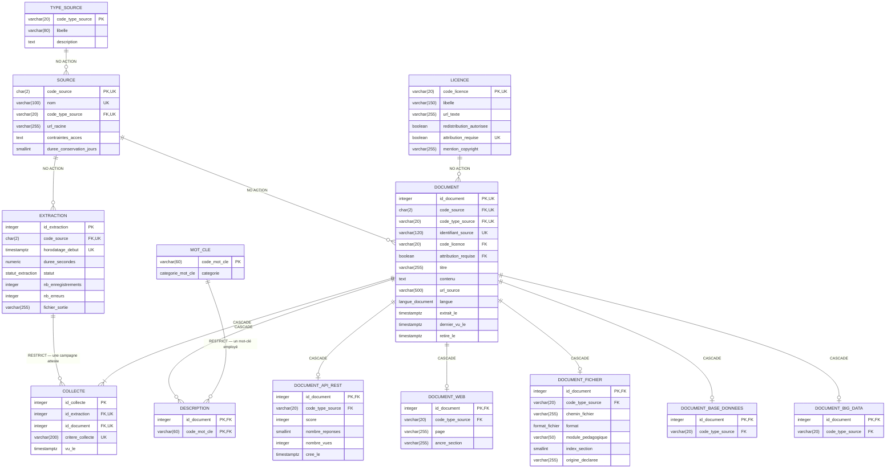

# Modèle physique de données — base `eduai_data`

**Date du relevé :** 4 septembre 2026
**Compétence visée :** C4 (épreuve E1) — création d'une base de données dans le
respect du RGPD
**Source amont :** [modèle logique](mld_eduai_data.md), validé le 26/08/2026
**Relevé sur :** la base en marche, PostgreSQL 16.15 en conteneur, port hôte 5433

> Les tables, colonnes, types, contraintes et index décrits ici ont été **lus
> dans le catalogue système de la base**, non recopiés depuis les scripts. Un
> écart entre les scripts et la base se verrait donc ici. Le
> [dictionnaire de données](dictionnaire_donnees_eduai_data.md), lui, est
> engendré depuis les scripts : les deux documents se contrôlent l'un l'autre.

---

## 1. Ce que ce document fixe, et pourquoi il existe

Le MLD s'arrête aux relations, aux clés et aux domaines logiques. Il le dit
lui-même : *« il ne fixe pas les types PostgreSQL, les index ni l'ordre des
scripts : cela relève du MPD »*. Ce document est ce MPD.

Il répond à trois questions que le niveau logique laisse ouvertes :

| Question | Où elle est traitée ici |
|---|---|
| Quel type physique pour chaque attribut, et sur quelle donnée réelle ? | § 4 et § 5 |
| Quelles règles le moteur fait-il respecter sans qu'aucun code intervienne ? | § 6 |
| Quels index, appelés par quelle requête, et lesquels ont été écartés ? | § 7 |

Le principe qui traverse ces trois réponses : **ce que le moteur peut garantir,
le code n'a pas à le vérifier.** Une règle inscrite dans le schéma survit à une
refonte de l'application ; une règle inscrite dans une fonction Python survit à
la prochaine relecture, au mieux.

## 2. Le schéma physique

Les treize tables avec **leurs types PostgreSQL réels**, relevés dans le
catalogue système le 4 septembre 2026. Les arêtes portent le **comportement à la
suppression**, que ni le MCD ni le MLD ne fixent.



### Comment ce diagramme a été produit, et comment le refaire

Il n'est pas dessiné : il est **lu dans la base**. La requête qui donne les
colonnes et leurs types :

```sql
SELECT c.relname, a.attname, format_type(a.atttypid, a.atttypmod), a.attnum
FROM pg_attribute a
JOIN pg_class c ON c.oid = a.attrelid
JOIN pg_namespace n ON n.oid = c.relnamespace
WHERE n.nspname = 'public' AND c.relkind = 'r'
  AND a.attnum > 0 AND NOT a.attisdropped
ORDER BY c.relname, a.attnum;
```

et celle qui donne les marques `PK`, `FK` et `UK` :

```sql
SELECT conrelid::regclass, contype, unnest(conkey)
FROM pg_constraint
WHERE connamespace = 'public'::regnamespace AND contype IN ('p','f','u');
```

Deux abréviations sont introduites pour la lisibilité du diagramme, et ce sont
des alias PostgreSQL valides, non des approximations : `character varying(n)` y
est noté `varchar(n)`, et `timestamp with time zone` y est noté `timestamptz`.

**Une seule précision est perdue, et il faut le dire :** la notation `erDiagram`
de Mermaid n'admet pas la virgule dans un nom de type. `extraction.duree_secondes`
y apparaît donc comme `numeric` alors que la colonne est déclarée
**`numeric(10,2)`** — dix chiffres significatifs dont deux décimales. Le § 5
porte la valeur exacte et sa justification.

### Ce que ce diagramme montre et que le MLD ne montrait pas

**Les types sont ceux du moteur**, avec leurs bornes : `char(2)` pour un code de
source, `varchar(120)` pour un identifiant, `text` sans borne pour le contenu,
`smallint` pour un nombre de réponses et `integer` pour un nombre de vues. Le
§ 4 justifie chacun sur la valeur réellement observée.

**Les quatre types énumérés apparaissent sous leur nom** — `langue_document`,
`format_fichier`, `statut_extraction`, `categorie_mot_cle` — là où le MLD ne
disait que « énuméré ». Ce sont des types du schéma, pas des colonnes texte
contraintes : ajouter une valeur est une opération de schéma.

**Les arêtes portent `CASCADE` ou `RESTRICT`**, et la différence est sémantique
et non technique : ce qui **décrit** un document disparaît avec lui — les cinq
sous-types, les collectes, les descriptions ; ce qui **atteste** d'une opération
ne disparaît pas — une campagne d'extraction et un mot-clé encore employé sont
en `RESTRICT`.

**Une colonne peut porter deux marques.** `DESCRIPTION.id_document` est `PK, FK`;
`DOCUMENT.code_source` est `FK, UK`. Ces cumuls ne sont pas décoratifs : c'est
exactement par eux que la partition et la non-divergence des colonnes
redondantes sont garanties par le moteur.

### Alternative textuelle au diagramme

Treize tables. `DOCUMENT` est au centre, avec treize colonnes, une clé primaire
entière engendrée, deux clés étrangères composites — vers `SOURCE` et vers
`LICENCE` — et une contrainte d'unicité sur `(code_source, identifiant_source)`
qui constitue sa clé naturelle. Cinq tables filles lui sont rattachées par
`(id_document, code_type_source)` en `ON DELETE CASCADE`. Deux tables de
jonction, `COLLECTE` et `DESCRIPTION`, la relient à `EXTRACTION` et à `MOT_CLE`;
leurs clés étrangères vers `DOCUMENT` sont en `CASCADE`, celles vers
`EXTRACTION` et `MOT_CLE` en `RESTRICT`. Quatre tables de référence complètent
l'ensemble : `TYPE_SOURCE`, `SOURCE`, `LICENCE`, `MOT_CLE`.

---

## 3. Le SGBD retenu

**PostgreSQL 16.15**, en conteneur (`postgres:16-alpine`), instance unique
partagée avec la base applicative `eduai_app`, port hôte **5433**.

Deux bases distinctes sur une même instance, et non deux schémas d'une même
base : PostgreSQL n'autorise pas de requête inter-bases sans extension.
L'isolation est donc **structurelle et non conventionnelle** — le pipeline peut
purger et recharger son corpus sans qu'une erreur de ciblage atteigne les
comptes des apprenants (décision 006).

Encodage `UTF8`, collation `C`. La collation `C` trie par octet plutôt que par
règle linguistique : c'est le bon choix pour un corpus bilingue où aucune des
deux langues ne doit être privilégiée dans l'ordre de tri, et c'est aussi la
plus rapide.

## 4. Les types énumérés

Quatre domaines fermés sont portés par des types énumérés PostgreSQL plutôt que
par des colonnes texte assorties d'un `CHECK`.

| Type | Valeurs | Colonne concernée |
|---|---|---|
| `langue_document` | `fr`, `en` | `document.langue` |
| `format_fichier` | `md`, `pdf`, `ipynb` | `document_fichier.format` |
| `statut_extraction` | `succes`, `echec`, `vide` | `extraction.statut` |
| `categorie_mot_cle` | `tag_source`, `module` | `mot_cle.categorie` |

**Choix : un type énuméré plutôt qu'une table de référence.** Motivation : ces
quatre domaines ne portent aucun attribut propre — un format de fichier n'a ni
libellé à traduire, ni durée de conservation, ni URL. Une table de référence
leur imposerait une jointure à chaque lecture pour ne rien rapporter. Les
domaines qui portent des attributs, eux, sont bien des tables : `type_source`,
`licence`, `source`.

**Ce que ce choix coûte, et qui est assumé :** ajouter une valeur à un type
énuméré est une opération de schéma (`ALTER TYPE`), pas une insertion. C'est
précisément l'effet recherché — un sixième type de source ne doit pas pouvoir
apparaître par un simple `INSERT`.

## 5. Les types physiques, choisis sur les données réelles

La règle appliquée : **le type se choisit sur la valeur observée, avec la marge
que la nature de la donnée impose** — pas sur le type le plus large « au cas
où », qui coûte de l'espace sur chaque ligne, ni sur le plus étroit qui tient
aujourd'hui, qui coûte une migration demain.

| Colonne | Type retenu | Maximum observé le 04/09 | Motif |
|---|---|---|---|
| `document.contenu` | `text` | 148 997 caractères | Aucune borne défendable. Un `varchar(n)` sur du contenu rédactionnel n'est qu'une limite arbitraire qui finira par tronquer |
| `document.titre` | `varchar(255)` | 150 caractères | Une borne existe côté source ; 255 laisse de la marge sans excès |
| `document.url_source` | `varchar(500)` | 130 caractères | Les URL de documentation avec ancre de section sont longues ; 500 est la borne usuelle |
| `document.code_source` | `char(2)` | `s1` à `s6` | Longueur fixe et connue, contrainte par un `CHECK` sur le motif `^s[1-9]$` |
| `document_api_rest.score` | `integer` | **13 135** | `smallint` plafonne à 32 767, soit moins d'un facteur 3 au-dessus de la valeur observée — sur une grandeur qui **croît avec le temps**, cette marge n'est pas suffisante |
| `document_api_rest.nombre_vues` | `integer` | **8 105 751** | Huit millions excluent `smallint`. `integer` plafonne à 2,1 milliards : la marge est de deux ordres de grandeur, `bigint` serait du gaspillage sur chaque ligne |
| `document_api_rest.nombre_reponses` | `smallint` | **69** | Le nombre de réponses à une question ne croît pas indéfiniment ; 32 767 est hors d'atteinte |
| `document_fichier.index_section` | `smallint` | quelques dizaines | Même raisonnement |
| `source.duree_conservation_jours` | `smallint`, `NULL` autorisé | — | `NULL` signifie **sans terme**, et non « zéro jour ». La distinction est portée par la nullité, non par une valeur sentinelle |
| `extraction.duree_secondes` | `numeric(10,2)` | — | Une durée mesurée est une grandeur exacte au centième ; un flottant introduirait une erreur de représentation dans un chiffre qui figure dans les rapports |
| tous les horodatages | `timestamp with time zone` | — | Le corpus vient de cinq fuseaux différents. Un `timestamp` sans fuseau perdrait l'information au chargement, silencieusement |

**Le cas du score mérite d'être défendu à l'oral**, parce que la valeur observée
tiendrait dans un `smallint`. Le motif n'est pas la valeur d'aujourd'hui mais sa
nature : un score Stack Overflow est cumulatif et ne décroît pas. Choisir un
type sur une grandeur monotone croissante demande une marge, pas un ajustement
au plus juste.

## 6. Les contraintes d'intégrité

**Cinquante-cinq contraintes** relevées dans le catalogue : **22 `CHECK`**,
**7 unicités**, **13 clés étrangères** et **13 clés primaires**. Elles sont
regroupées ci-dessous par ce qu'elles empêchent, et non par leur type — c'est
l'interdiction qui se défend, pas la syntaxe.

### 5.1 Ce qui empêche une donnée fausse d'entrer

| Contrainte | Ce qu'elle interdit |
|---|---|
| `document_titre_non_vide`, `document_contenu_non_vide` | Un document dont le titre ou le contenu ne serait que des espaces. `btrim(...) <> ''` — la vérification de longueur seule laisserait passer trois espaces |
| `mot_cle_minuscules` | Un mot-clé qui ne serait pas en minuscules, ce qui produirait deux étiquettes pour un même sujet |
| `mot_cle_non_vide` | Une étiquette vide |
| `source_code_valide` | Un code de source hors du motif `s1`…`s9` |
| `source_conservation_positive` | Une durée de conservation nulle ou négative — `NULL` reste autorisé, il signifie « sans terme » |
| `document_api_rest_vues`, `..._reponses`, `extraction_volume_positif`, `extraction_erreurs_positif`, `extraction_duree_positive` | Un compteur négatif |
| `document_retrait_posterieur` | Un document retiré avant d'avoir été vu pour la dernière fois |

### 5.2 Ce qui empêche un bilan de mentir

Deux contraintes portent la leçon de l'incident 001, où un chargement s'était
annoncé réussi sur une base restée vide :

| Contrainte | Ce qu'elle interdit |
|---|---|
| `extraction_succes_non_vide` | Une extraction déclarée `succes` avec **zéro enregistrement**. Le statut ne peut plus contredire le décompte |
| `extraction_vide_sans_donnees` | Une extraction déclarée `vide` qui porterait pourtant des enregistrements |

C'est le cœur du dispositif : **une déclaration qui contredit son effet est
refusée par le moteur**, pas relevée après coup par une relecture.

### 5.3 Ce qui rend la spécialisation exclusive sans une ligne de code

La partition de `document` en cinq sous-types est déclarative. Elle repose sur
deux mécanismes qui se complètent :

1. `document_partition_uk` — unicité sur `(id_document, code_type_source)`,
   ce qui fait de ce couple une clé référençable ;
2. dans chaque table fille, une clé étrangère composite vers ce couple, plus un
   `CHECK` qui fige la valeur du type : `document_api_rest_type` impose
   `code_type_source = 'api_rest'`, `document_web_type` impose `'scraping'`, et
   ainsi de suite pour les cinq.

**Conséquence : un document issu du scraping ne peut pas obtenir de ligne dans
`document_api_rest`.** Non pas « ne devrait pas » — ne peut pas. Aucun code,
aucune migration, aucune insertion manuelle ne contourne cela.

Cette garantie a un prix, assumé et signalé : `document` porte
`code_type_source` et `attribution_requise`, redondants avec `source` et
`licence`. Deux entorses à la troisième forme normale. Elles sont **rendues
inoffensives par des clés étrangères composites** — `document_source_fk` vers
`source(code_source, code_type_source)` et `document_licence_fk` vers
`licence(code_licence, attribution_requise)` — qui interdisent aux deux copies
de diverger.

### 5.4 Ce qui fait respecter la licence

| Contrainte | Ce qu'elle garantit |
|---|---|
| `document_attribution_url` : `CHECK (NOT attribution_requise OR url_source IS NOT NULL)` | Un document dont la licence exige l'attribution **ne peut pas** être enregistré sans l'adresse de sa source |

C'est une obligation juridique vérifiée par le moteur de base de données. Elle
ne dépend d'aucun appel de fonction, donc d'aucun appel oublié.

### 5.5 Les comportements de suppression, choisis un par un

| Clé étrangère | Comportement | Motif |
|---|---|---|
| Les cinq sous-types vers `document` | `ON DELETE CASCADE` | La spécialisation n'existe pas sans son document |
| `collecte` vers `document` | `ON DELETE CASCADE` | Une trace de collecte sans document est un orphelin |
| `description` vers `document` | `ON DELETE CASCADE` | Idem pour les étiquettes |
| `collecte` vers `extraction` | **`ON DELETE RESTRICT`** | Une campagne d'extraction est une **trace**. La supprimer effacerait la traçabilité de ce qui a été collecté quand |
| `description` vers `mot_cle` | **`ON DELETE RESTRICT`** | Un mot-clé encore employé ne se supprime pas par inadvertance |

La différence entre `CASCADE` et `RESTRICT` n'est pas technique, elle est
sémantique : ce qui **décrit** un document disparaît avec lui, ce qui **atteste**
d'une opération ne disparaît pas.

## 7. Les index

Huit index explicites, en plus des index créés d'office par les clés primaires
et les contraintes d'unicité. **Chacun répond à une requête prévue** — un index
qu'aucune requête n'appelle ralentit toutes les écritures pour rien.

| Index | Table | Définition | Requête qui l'appelle |
|---|---|---|---|
| `idx_document_source` | `document` | `btree (code_source)` | Le décompte par source, affiché par l'API de statistiques |
| `idx_document_licence` | `document` | `btree (code_licence)` | Le filtre de redistribution, appliqué à **chaque** requête de l'API du jeu de données |
| `idx_document_langue_citable` | `document` | `btree (langue) WHERE url_source IS NOT NULL` | La sélection des documents indexables par le RAG. **Index partiel** : un document sans URL n'est jamais citable, l'indexer serait du poids mort |
| `idx_document_recherche` | `document` | `gin` sur `to_tsvector('simple', titre \|\| contenu)` | La recherche plein texte du point d'accès `/api/dataset/documents/` |
| `idx_collecte_document` | `collecte` | `btree (id_document)` | « Quelles campagnes ont vu ce document ? » |
| `idx_collecte_extraction` | `collecte` | `btree (id_extraction)` | « Qu'a rapporté cette campagne ? » |
| `idx_description_mot_cle` | `description` | `btree (code_mot_cle)` | « Quels documents portent ce mot-clé ? » — le sens inverse de la clé primaire |
| `idx_extraction_source_date` | `extraction` | `btree (code_source, horodatage_debut DESC)` | « La dernière campagne de cette source » — le `DESC` évite un tri |

**Deux choix méritent d'être défendus.**

`idx_document_recherche` emploie la configuration **`simple`** et non `french`
ou `english`. Le corpus est bilingue : une configuration à racinisation ne vaut
que pour la langue qu'elle connaît. `simple` ne racinise pas, mais traite les
deux langues identiquement — ce qui vaut mieux que bien traiter l'une et mal
l'autre. C'est un index **d'expression** et non une colonne matérialisée : une
colonne `tsvector` devrait être tenue à jour par le chargeur ou par un
déclencheur, donc pourrait diverger du contenu ; l'expression est calculée par
le moteur et ne peut pas se désynchroniser.

`idx_document_langue_citable` est **partiel**. Sur 7 869 documents, il n'en
indexe que ceux qui portent une URL — les seuls que le RAG puisse citer.

### Les index écartés, avec leur motif

| Index envisagé | Écarté parce que |
|---|---|
| `document(extrait_le)` | Aucune requête ne filtre sur cette date seule ; la purge par ancienneté passe par `source` |
| `document(identifiant_source)` | Déjà couvert par l'unicité `(code_source, identifiant_source)`, dont c'est le second terme utilisable en préfixe inverse rarement demandé |
| `mot_cle(categorie)` | 1 211 lignes : un balayage complet est plus rapide qu'un parcours d'index |
| `document(titre)` | La recherche sur le titre passe par l'index plein texte, qui le couvre déjà |

**Un index inutile n'est pas neutre :** il est maintenu à chaque insertion, à
chaque mise à jour et à chaque suppression. Sur un chargement de 7 868
documents, c'est mesurable.

## 8. Les vues de contrôle

Quatre vues, qui ne servent pas à l'application mais à **vérifier la base**.

| Vue | Ce qu'elle répond |
|---|---|
| `controle_couverture_sources` | Les cinq types exigés par C1 portent-ils tous des documents ? |
| `controle_partition` | Chaque document a-t-il exactement une ligne de sous-type ? |
| `documents_indexables` | Ce que le RAG a le droit de citer — jointure `document × licence` |
| `documents_non_redistribuables` | Ce que l'API doit taire, et pour quelle licence |

Les deux premières sont des **contrôles de cohérence exécutables** : elles
rendent zéro ligne quand tout va bien. Une vue qui doit être vide se relit en
une requête, là où la même vérification en Python demanderait qu'on pense à
l'appeler.

## 9. L'ordre des scripts

Le schéma se rejoue depuis zéro, dans cet ordre, chaque fichier supposant le
précédent :

| Script | Rôle |
|---|---|
| `00_bases.sql` | Création des deux bases et des rôles |
| `01_schema.sql` | Types énumérés, tables, clés primaires et étrangères |
| `02_index.sql` | Les huit index, chacun avec son commentaire de motif |
| `03_contraintes.sql` | Les `CHECK` et les unicités |
| `04_donnees_reference.sql` | Les 5 types de source, 12 licences, 6 sources |
| `05_purge_conservation.sql` | La purge par durée de conservation (RGPD) |
| `05_purge_denombrement.sql` | Le dénombrement préalable à la purge |
| `06_role_lecture.sh` | Le rôle `eduai_lecture`, en lecture seule, employé par l'API du jeu de données (C5) |

L'ordre n'est pas cosmétique : l'incident 015 est né d'un schéma corrigé après le
premier démarrage du volume, donc jamais rejoué. **Le schéma doit être
rejouable depuis une base vierge**, et la chaîne d'intégration continue le
rejoue à chaque exécution pour que cette propriété soit vérifiée et non
supposée.

## 10. Les rôles et privilèges

| Rôle | Droits | Employé par |
|---|---|---|
| `eduai` | Propriétaire du schéma, lecture et écriture | Le pipeline de chargement |
| `eduai_lecture` | **`SELECT` uniquement** | L'API du jeu de données (C5) |

`eduai_lecture` est le troisième des trois verrous qui rendent l'API en lecture
seule, après le routeur de base de données de Django et les vues. C'est le seul
des trois que le code applicatif ne peut pas contourner : il a déjà refusé une
commande de migration avant que le code ait eu son mot à dire.

## 11. Le volume constaté

Relevé du 4 septembre 2026 par `count(*)`, non par les statistiques du
planificateur.

| Table | Lignes | Taille avec index |
|---|---|---|
| `document` | 7 869 | 46 Mo |
| `description` | 20 545 | 2,9 Mo |
| `collecte` | 14 992 | 2,5 Mo |
| `document_big_data` | 4 948 | 504 ko |
| `document_api_rest` | 1 273 | 376 ko |
| `document_web` | 1 240 | 368 ko |
| `document_fichier` | 381 | 296 ko |
| `mot_cle` | 1 211 | 208 ko |
| `extraction` | 15 | 56 ko |
| `licence` | 12 | 48 ko |
| `source` | 6 | 64 ko |
| `type_source` | 5 | 32 ko |
| `document_base_donnees` | 27 | 24 ko |
| **Base entière** | | **61 Mo** |

`document` concentre 75 % du volume, et c'est la colonne `contenu` qui le porte.
C'est ce qui justifie que la recherche plein texte passe par un index plutôt que
par un balayage : sans lui, chaque requête relirait ces 46 mégaoctets.

**Un document porte `retire_le`** : une section disparue de `docs.python.org`
entre deux campagnes. Elle n'est pas supprimée, elle est datée — la base
distingue ce qui n'a jamais existé de ce qui a cessé d'exister. C'est aussi ce
qui explique l'écart d'une unité entre les 7 868 documents produits par le
pipeline et les 7 869 présents en base.

## 12. Ce que ce document ne fixe pas

- **Le corpus vectoriel.** ChromaDB est un artefact aval, reconstruit depuis
  cette base. Il n'est pas la base de données évaluée par C4.
- **La base applicative `eduai_app`.** Son schéma est géré par les migrations
  Django et relève de C17.
- **Le partitionnement physique et la réplication.** À 61 mégaoctets, ni l'un ni
  l'autre ne se justifie. Les mentionner comme « prévus » serait décrire un
  système qui n'existe pas.
